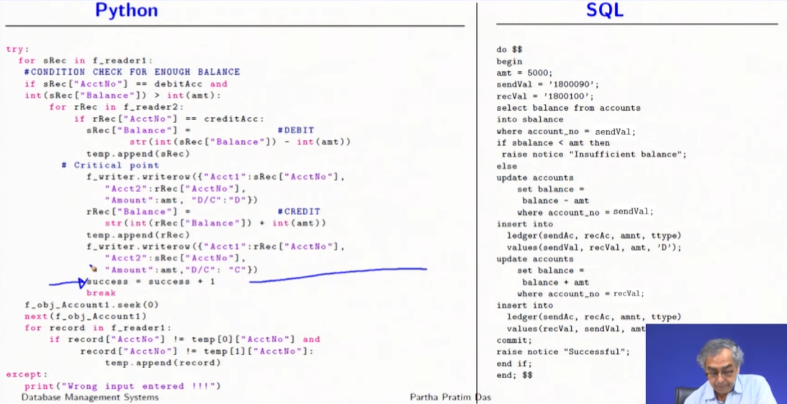

# Evolution of Data Management
- Why do we need to store data?
  - To retrieve it later
  - Transactional data
  - Analytical data
  - Archival data
- Who needs to store data?
  - Individuals
  - Businesses
  - Governments
  - and more $\dots$
- Types of approaches to data management
  - Physical files / Folders, Documents and Book Keepking $\dots$
  - Electronic files / Spreadsheets and CSVs, JSON, XML, $\dots$
### Why leave the file system?
- Lack of efficiency
  - As the size of the data grows, the file system becomes inefficient
  - It takes more time to find the data
  - More time to perform operations on the data
---
## Case Study: A Bank Transaction
- Consider a simple banking system where a person can open a new account, transfer fund to an existing account and check the history of all her transactions till date.
- The application performs the following checks:
  - If the account balance is not enough, it will not allow the fund transfer. If the account numbers are not correct, it will flash a message and terminate the
  transaction.
  - If a transaction is successful, it prints a confirmation message.
- We will use a file based system and a sql based system to implement this application.
- The file based system will use a csv file to store the data.
- The sql based system will use a SQL database to store the data.
- The application will be written in python.
  | File Based System | SQL Based System |
  | --- | --- |
  | We do not need to to open and close a file explicitly. | We just connect to the database|
  | We need to read the data from the file and convert it into a list of dictionaries. | We directly perform the actions on the table |

  
