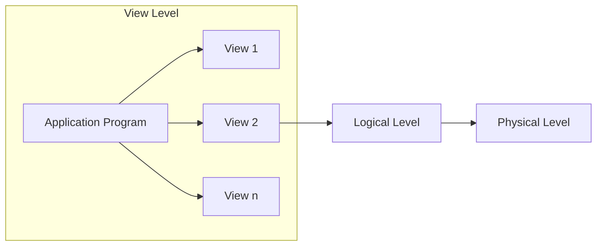
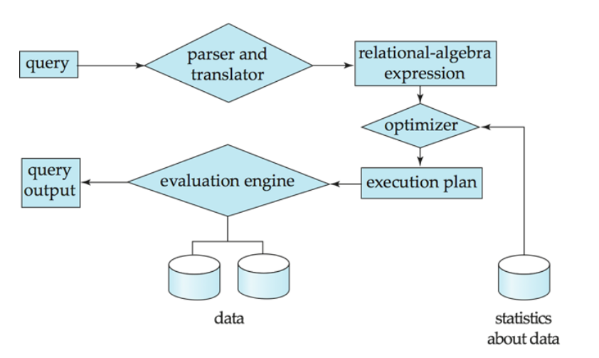

# Levels of Abstraction
- Physical level: Describe how a record (e.g. customer) is stored.
- Logical level: Describe data stored in database, and the relationships among the data.
  ```
   type instructor = record
     ID: integer;
     name: string(20);
     dept_name: string(20);
     salary: real
  end;
  ```
- View level: Application programs hide details of the data type
  - Views can also hide infromation (e.g. salary) for security reasons.


- Instance of a database: The actual content of the database at a particular point in time.
- Schema of a database: The description of a database. The schema changes very infrequently. The schema is also sometimes called the intension of a database.
  - Physical schema: database design at the physical level
  - Logical schema: database design at the logical level
    - The logical schema is also called the conceptual schema.
- Physical Data Independence: The ability to modify the physical schema without changing the logical schema.
### Data Models
- Collection of tools for describing:
  - Data
  - Data relationships
  - Data semantics
  - Data constraints
- Relational Model
  - Data is stored in relations (tables)
  - Relations can be queried
  - Relations can be manipulated using relational operators
- Other older models
  - Hierarchical Model
  - Network Model
- Recent Models for Semi-structured or Unstructured Data
  - XML
  - JSON
  - Key-value stores
  - Graph databases
  - Content Addressable Storage (CAS) systems
### Data Definition Language (DDL)
- Specification notation for defining the database schema
  - Example
    - ```create table instructor (ID integer, name string(20), dept_name string(20), salary real)```
- DDL compiler generates a set of tables stored in a data dictionary
- Data dictionary contains metadata (i.e. data about data)
  - E.g. type of each data element, constraints, etc.
### Data Manipulation Language (DML)
- Language for accessing and manipulating the data organized by the appropriate data model:
  - DML also known as query language
- Two classes of languages
  - Pure - used for proving properties of DML programs
    - Tuple relational calculus
    - Domain relational calculus
  - Commercial – used in commercial systems
    - SQL is the most widely used commercial language

### SQL (Structured Query Language)
- Most widely used commercial query language
- SQL is NOT a Turing complete language
  - It cannot express all possible computations
- To be able to compute complex functions, SQL is usually embedded in some
- higher-level language
- Application programs generally access databases through one of
  - Language extensions to allow embedded SQL
  - Application Programming Interface or API (for example, ODBC/JDBC) which allow SQL queries to be sent to a database

### Database Design
The process of designing the general structure of the database
- Logical Design
  - Designing the database schema
  - Designing the constraints
  - What relation schemas should we have and how should the attributes be distributed among the various relation schemas?
- Physical Design – Deciding on the physical layout of the database
### Design Approaches
- Need to come with a good Design Approach
- Two ways of doing so:
- Entity Relationship Model (Chapter 7)
  - Models an enterprise as a collection of entities and relationships
- Represented diagrammatically by an entity-relationship diagram
  - Normalization Theory (Chapter 8)
    - Formalize what designs are bad, and test for them

#### Object Relational Model
- Relation model : flat, atomic values
- Object Relational Data Models
  - Extend the relational data model by including object orientation and constructs to deal with added data types
  - Allow attributes of tuples to have complex types, including non-atomic values such as nested relations
  - Preserve relational foundations, in particular the declarative access to data, while extending modeling power
  - Provide upward compatibility with existing relational languages
#### XML: Extensible Markup Language
- XML is a markup language for documents containing structured information (e.g. data)
- XML is a W3C standard
### Database Engine
- Storage Manager: Responsible for storing and retrieving data and its a interface between low-level data stored in the database and the application programs and queries submitted to the system
  - It must be efficient in storing and retrieving data
- Query Processor: Translates queries in a query language (e.g. SQL) into low-level instructions that the storage manager understands
  - It has three major components
    - Parsing and translation
    - Optimization
    - Evaluation

- Transaction Manager: Ensures that the database remains in a consistent (correct) state despite system failures (e.g. power failures and operating system crashes) and transaction failures
  - What transactions are
    - A transaction is a collection of operations that performs a single logical function in a database application
    - A transaction may consist of a single operation, or it may consist of many operations
    - A transaction may consist of operations that access and update many parts of the database
    - A transaction may consist of operations that involve more than one database
  - Transaction managment component ensures that the database remains in a consistent (correct) state despite system failures (e.g., power failures and operating system crashes) and transaction failures.
  - Concurrency-control manager controls the interaction among the concurrent transactions, to ensure the consistency of the database.
### Database Architecture
- The architecture of a database system is greatly influenced by the underlying computer system on which the database is running:
  - Centralized
  - Client-server
  - Parallel (multi-processor)
  - Distributed
  - Cloud