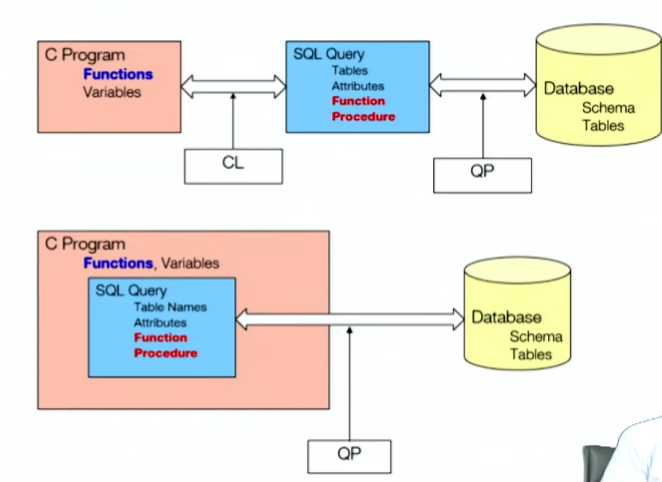

# Function and Procedural Constructs

- 
- Functions / Procedures are stored in the database and can be called from SQL statements. They were introduced in SQL:1999.
- Functions / Procedures are written in a procedural language (e.g. PL/SQL, T-SQL, etc.) or external language (e.g. Java, C, etc.).
- Functions written in an external language are called external functions. They are used to extend the functionality of the database or with data types that are not supported by the database (e.g. image, audio, video, etc.).
- Functions written in a procedural language are called stored functions. They are used to encapsulate business logic and to improve performance.

## Function

- Define a fucntion given that the name of a department returns the count of number of instructors in that department.

```sql
create function dept_count( dept_name varchar(20))
  return integer
  begin
    declare d_count integer;
      select count(*) into count
      from instructor
      where dept_name = dept_name;
    return d_count;
  end;
```

- Call the function

```sql
select dept_count('Comp. Sci.');
from department
where dept_count('Comp. Sci.') > 10;
```

- Compound statement : A block of code that contains a sequence of SQL and procedural statements. There can be nested compound statements. A compound statement is enclosed in a BEGIN and END block.
- Return all the instructors in a department

```sql
create function dept_instructors( dept_name varchar(20))
  return table (ID char(5), name varchar(20), dept_name varchar(20), salary numeric(8,2))
  begin
    declare result table (ID char(5), name varchar(20), dept_name varchar(20), salary numeric(8,2));
    insert into result
      select ID, name, dept_name, salary
      from instructor
      where instructor.dept_name = instructor_of.dept_name;
    return result;
  end;
```

- useage:

  - ```sql
    select * from dept_instructors('Comp. Sci.');
    ```

## Procedure

- The dept_count function can be written as a procedure as follows:

```sql
create procedure dept_count(in dept_name varchar(20), out d_count integer)
  begin
    select count(*) into d_count
    from instructor
    where instructor.dept_name = instructor_of.dept_name;
  end;
```

- Procdeures can be invoked either from SQL statements or from other procedures. The following statement invokes the dept_count procedure from a SQL statement:

```sql
call dept_count('Comp. Sci.', @count);
```

## Language Constructs

- white loop:
  - ```sql
    while condition do
      statements
    end while;
    ```
- repeat loop:
  - ```sql
    repeat
      statements
    until condition
    end repeat;
    ```
- for loop:
  - ```sql
    for var := start_value to end_value do
      statements
    end for;
    ```
- if-then-else:
  - ```sql
    if condition then
      statements
    else
      statements
    end if;
    ```
- case:
  - ```sql
    case
      when condition then
        statements
      when condition then
        statements
      else
        statements
    end case;
    ```
- exception handling:
  - ```sql
    declare continue handler for sqlstate '23000'
      begin
        rollback;
        signal sqlstate '45000' set message_text = 'Duplicate key';
      end;
    ```
  - Signalling of exceptions conditions and the use of handlers are implementation dependent. The above example is for MySQL.

### Sandbox

- To deal with security problems, we can do one of the following:
- Use sandbox techniques
  - That is, use a safe language like Java, which cannot be used to access/damage other parts of the database code
  - Run external language functions/ procedures in a separate process, with no access to the database process' memory - Parameters and results communicated via inter-process communication

## Triggers

- A trigger is a procedure that is automatically invoked by the DBMS in response to a specified event. Triggers are used to enforce integrity constraints and to perform other actions that are not directly supported by the DBMS. Triggers are written in a procedural language (e.g. PL/SQL, T-SQL, etc.) or external language (e.g. Java, C, etc.).
- Triggers are invoked by the DBMS in response to a specified event. The following events are supported by most DBMSs:
  - Insertion of a tuple into a table
  - Deletion of a tuple from a table
  - Modification of a tuple in a table
  - Execution of a SQL statement
- To design a trigger, we must:

  - Specify the event that causes the trigger to be invoked
  - Specify the time at which the trigger is invoked (before or after the event)
  - Specify the action to be performed by the trigger

- They can be applied to Row or Statement level.
  - Row level: The trigger is invoked once for each row affected by the event that causes the trigger to be invoked.
  - Statement level: The trigger is invoked once for each event that causes the trigger to be invoked.

### Before Trigger

- A before trigger is invoked before the event that causes the trigger to be invoked. A before trigger can be used to:
  - Enforce integrity constraints
  - Modify the tuple that caused the trigger to be invoked
  - Modify other tuples in the database
  - Execute SQL statements

### After Trigger

- An after trigger is invoked after the event that causes the trigger to be invoked. An after trigger can be used to:
  - Enforce integrity constraints
  - Modify other tuples in the database
  - Execute SQL statements
  - Send an email message
  - Run a non-database program (e.g. a Java program)

### Trigger Example

- Create a trigger that converts blank grades into null

```sql
create trigger setnull_trigger update of takes
referencing new as n
for each row
when (n.grade = ' ')
  begin atomic
    set n.grade = null;
  end;
```

### When to use triggers?

- The optimal use of DML triggers is for short, simple, and easy to maintain write
  operations that act largely independent of an applications business logic.
  Typical and recommended uses of triggers include:
  - Logging changes to a history table
  - Auditing users and their actions against sensitive tables
  - Adding additional values to a table that may not be available to an application (due to security restrictions or other limitations), such as:
- Adding triggers is often seen as faster and easier than modifying an application to perform the same task. However, triggers are not a substitute for application logic. Triggers should not be used to:

#### Triggers should not be used to:

- Triggers can become dangerous when:
  - There are too many
  - Trigger code becomes complex
  - Triggers go cross-server - across databases over network
  - Triggers call triggers
  - Recursive triggers are set to ON. This database-level setting is set to off by default
  - Functions, stored procedures, or views are in triggers
  - Iteration occurs
