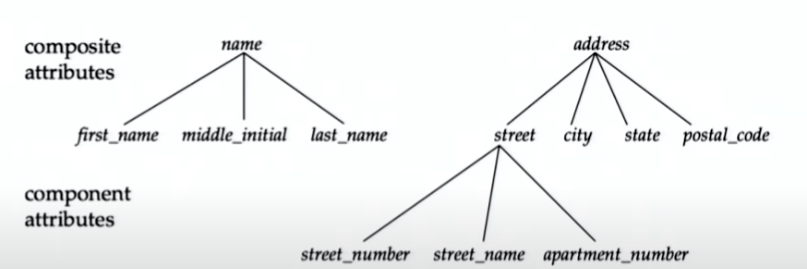
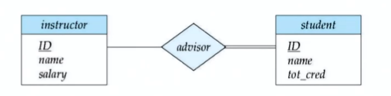
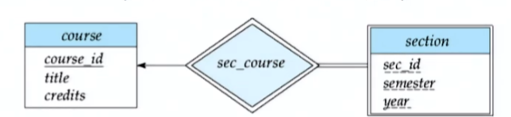
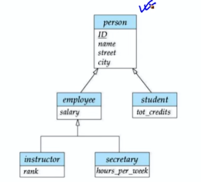

# Entity Relation Model
## Design Process
- Satisfaction of requirements **functional requirment**
- One must know the limitations of the target DBMS
- Meets implicit or explicit requirements on performance and resource usage
- Satisfies implicit or explicit design criteria on the form of the artifact
- Satisfies restrictions on the design process itself, such as its length or cost, or the tools available for doing the design
## Abstraction
- Abstraction is the process of reducing complexity by hiding irrelevant details and focusing on relevant details to a particular context or problem space.
- Abstraction is a fundamental concept in computer science and software development. The process of abstraction can also be referred to as modeling and is closely related to the concepts of theory and design.
- Abstraction provides the major tool to handle Disorganized Complexity by chunking information
- Ignore inessential details, deal only with the generalized, idealized model of the world
## Model Building
- A model is a simplified representation of some real-world object or event that is used to better understand the object or event. A model is a simplification of reality.
  - Physical models
    - Time and space are explicitly represented
  - Chemistry Model
    - Valence-Bond Structure
  - And many more ...
## Logical Model
- A logical model is a representation of a business system that gives form to the structure of the data, and control of the data flow, processes, and interfaces. It is intended to be independent of the technical implementation.
### Entity-Relationship Model
- The entity-relationship model is a conceptual model of data. It is based on the perception of a real world that consists of a collection of basic objects, called entities, and of relationships among these objects. The entity-relationship model is widely used in database design.
- The entity-relationship model is a high-level conceptual data model. It supports a set of constructs that can be used to describe the semantics of data at a high level of abstraction.
- Relationships are associations between entities. They are represented by diamonds. The cardinality of a relationship is the number of entities to which another entity can be associated via the relationship.
- An ER Model employs three main constructs:
  - Entities
  - Attributes
  - Relationships
- The ER model also has an associated diagrammatic representation, the ER diagram, which can express the overall logical structure of a database graphically
#### Attributes
- An Attribute is a property associated with and entity / entity set. Based on the values of certain attributes, an entity can be identified uniquely
- Attribute types:
  - Simple and Composite attributes
  - Single-valued and Multivalued attributes
    - Example: Multivalued attribute: phone-numbers
  - Derived attributes
    - Can be computed from other attributes
      - Example: age, given date-of-birth
- Domain: Set of permitted values for each attribute
- Composite attributes can be nested to any level
#### Entity Sets
- An entity is an object that exists and is distinguishable from other objects.
- Example: specific person, company, event, plant
- An entity set is a set of entities of the same type that share the same properties.
- Example: set of all persons, companies, trees, holidays
An entity is represented by a set of attributes; i.e., descriptive properties possessed all members of an entity set.
- Example:
- ```sql
  instructor = (ID, name, street, city, salary ) = (course-id, title,credits)
  ```
- A subset of the attributes form a primary key of the entity set; that is,
identifying each member of the set.
- Primary key of an entity set is represented by underlining it
#### Relations Sets
- Binary relationship
  - involves two entity sets (or degree two).
  - most relationship sets in a database system are binary.
- Relationships between more than two entity sets are rare. Most relationships are binary
  - Example: students work on research projects under the guidance of an instructor.
  - relationship proj-guide is a ternary relationship between instructor, student, and project
##### Redundant Attributes
- Redundant attributes can be removed from a relation by decomposing the relation into two relations and placing the redundant attribute in one of the two relations. The two relations are then linked by the primary key of the relation that contains the redundant attribute.
#### Mapping Cardinalities
- Express the number of entities to which another entity can be associated via a relationship set.
- Most useful in describing binary relationship sets.
- For a binary relationship set the mapping cardinality must be one of the following types:
  - One to one
    - One unique entity in A is associated with at most one entity in B, and vice versa.
  - One to many
    - One unique entity in A is associated with any number (zero or more) of entities in B, but an entity in B can be associated with at most one entity in A.
  - Many to one
    - Many entities in A are associated with at most one entity in B, but an entity in B is associated with any number (zero or more) of entities in A.
  - Many to many
    - Many entities in A are associated with any number (zero or more) of entities in B, and vice versa.
#### Weak Entity Sets
- An entity set that does not have a primary key is referred to as a weak entity set. The existence of a weak entity set depends on the existence of a strong entity set. A weak entity set is said to be existence-dependent on its strong entity set.
- Example:
  - A door number is a weak entity. It cannot exist without the existence of a building. A building is a strong entity. It can exist without the existence of a door number.
  - A weak entity set is represented by a double rectangle.
#### ER Diagram
- Entities can be represented graphically as follows:
  - Rectangles represent entity sets.
  - Attributes are listed inside entity rectangle.
  - Underline indicates primary key attributes.
- Diamonds represent relationship sets.
  - If that relationship has an attribute, it is represented by an dotted line connected to a diamond.
- Entity sets of a relationship need not be distinct Each occurrence of an entity set plays a "role" in the relationship
- The labels "course-id" and "prereq-id" are called roles.
- one-to-many relationship between an instructor and a student
  - an instructor is associated with several (including 0) students via advisor
  - a student is associated with at most one instructor via advisor
  - It is shown by drawing a line from the entity set with cardinality 1 to the entity set with cardinality N
- Many to many relationship between an instructor and a student
  - an instructor is associated with several (including 0) students via teaches
  - a student is associated with several (including 0) instructors via teaches
  - It is shown by drawing a line from the entity set with cardinality N to the entity set with cardinality M
- Total participation (indicated by double line) of entity set E in relationship set R means every entity in E participates in at least one relationship in R
- Many-to-one and one-to-many relationship sets that are total on the many-side can be represented by adding an extra attribute to the "many" side, containing the primary key of the "one" side.
- Partial participation (indicated by single line) means some entities in E do not participate in any relationship in R 
  - We underline the discriminator of a weak entity set with a dashed line
  - The relationship between a weak entity set and its identifying entity set is indicated by a double diamond
  - Weak entity sets are indicated by double rectangles 
- Composite attributes are flattened out by creating a separate attribute for each component attribute.
#### Non-binary Relationships
- Most relationship sets are binary
- There are occasions when it is more convenient to represent relationships as non-binary
- ER Diagram with a Ternary Relationship
##### Cardinality Constraints on Ternary Relationship Sets
- We allow at most one arrow out of a ternary (or greater degree) relationship to indicate a cardinality constraint
- For example, an arrow from proj-guide to instructor indicates each student has at most one guide for a project
- If there is more than one arrow, there are two ways of defining the meaning.
  - For example, a ternary relationship R between A, B and C with arrows to B and C could mean that each A is associated with at most one B and at most one C, or it could mean that each A is associated with at most one B and at most one of the C's.
#### Specialization : ISA
- Top down design process : we designate subgroupings within an entity set that are distinctive from other entities in the set
-  
- Overlapping : employees and student are overlapping
- Disjoint : Instructors and secretaries are disjoint
#### Generalization
- Bottom up design process : we designate superclasses and subclasses of entity sets that share common attributes or relationships distinct from other entities in the set.
- Completeness Constraint
  - Total specialization rule : every entity in the superclass must be a member of some subclass in the specialization
  - Partial specialization rule : an entity may or may not belong to any of the subclasses in the specialization
- Partial generalization is the default. We can specify total generalization in an ER diagram by adding the keyword total in the diagram and drawing a dashed line the keyword to the corresponding hollow arrow-head to which it applies (for a total generalization), or to the set of hollow arrow-heads to which it applies (for an overla in eneralization
#### Aggregation
- Aggregation is an abstraction through which relationships are treated as higher-level entities (or relationships).
- To represent aggregation, create a schema containing
  - Primary key of the aggregated relationship,
  - The primary key of the associated entity set
  - Any descriptive attributes
### Design Issues
- Use of Entity Sets vs. Attributes
  - Should a particular concept be modeled as an entity set, or as an attribute?
  - Example: Should we model a course as an entity set, or as an attribute of an instructor entity set?
  - If a concept can have independent existence, then it should be modeled as an entity set.
  - If a concept is merely a descriptive attribute of another entity, then it should be modeled as an attribute.
#### Binary vs Non-binary Relationships
- Should a relationship be modeled as a binary relationship, or as a non-binary relationship?
- In general, any non-binary relationship can be represented using binary relationships by creating an artificial entity set.
- Also need to translate constraints
  - Translating all constraints may not be possible
  - There may be instances in the translated schema that cannot correspond to any instance of R
## ER Design Process
- The use of an attribute or entity set to represent an object
- Whether a real-world concept is best expressed by an entity set or a relationship set
- The use of a ternary relationship versus a pair of binary relationships
- The use of a strong or weak entity set
- The use of specialization/generalization — contributes to modularity in the design
- The use of aggregation can treat the aggregate entity set as a single unit without concern for the details of its internal structure