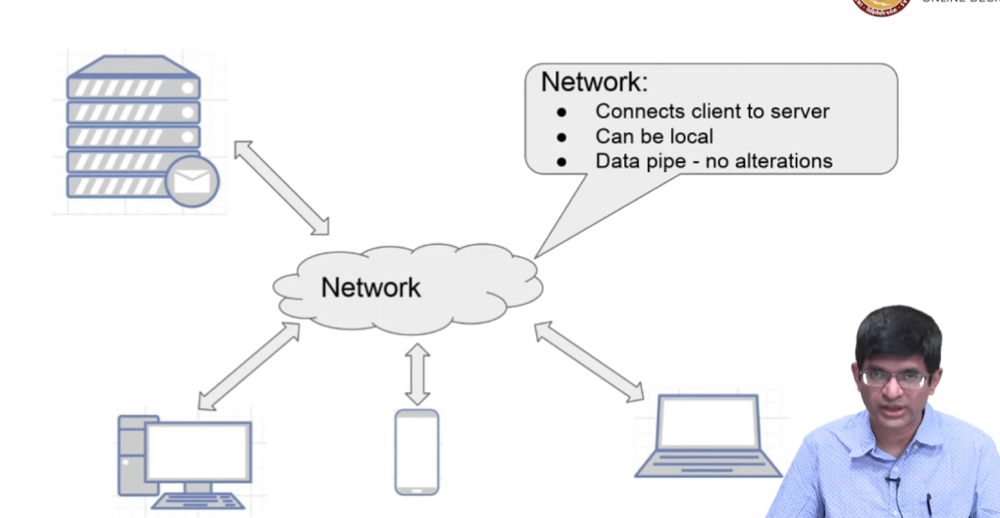

# Architecture
- Client-Server Architecture
- Peer-to-Peer Architecture
## Client - Server Architecture
- The client-server architecture is the most common distributed system architecture which decomposes the system into two major subsystems or logical processes −
  - The server
  - The client

### Client Server Model
- Explicit differentiation between clients and servers
- Local Systems:
  - Both client and server are on the same machine (e.g. a PC)
  - Conceptually, the client and server are still distinct and communicate with each other over a network
- Machine Client
  - Need not have user interaction
- Variants
  - Multiple servers, single queue, multiple queues, load balancing etc.
#### Examples
- Web Server
  - Client: Browser
  - Server: Web Server
- Email
  - Client: Email Client
  - Server: Mail Server
- File Transfer
  - Client: FTP Client
  - Server: FTP Server
- WhatsApp / Messenging
  - Client: WhatsApp / Messenging App
  - Server: WhatsApp / Messenging Server
## Peer-to-Peer Architecture (Distributed) Model
- All peers are equal and can act as both clients and servers
  - But some peers may be more powerful than others
- Error tolerance
  - No single point of failure
- Shared information
#### Examples of Peer-to-Peer Architecture
- BitTorrent
  - Client: BitTorrent Client
  - Server: None
- Blockchain based systems
  - Client: Blockchain Client
  - Server: None
- IPFS, Tahoe-LAFS, etc.
  - Client: IPFS Client
  - Server: None
