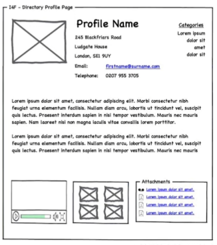

# Tools used for Views

## Wireframes

- A wireframe is a visual guide that represents the skeletal framework of a website. Wireframes are created for the purpose of arranging elements to best accomplish a particular purpose. The purpose is usually being informed by a business objective and a creative idea. The wireframe depicts the page layout or arrangement of the website’s content, including interface elements and navigational systems, and how they work together. The wireframe usually lacks typographic style, color, or graphics, since the main focus lies in functionality, behavior, and priority of content.

  

  > A wireframe of directory profile page

- Wireframes focus on:
- The kinds of information displayed. Wireframes illustrate the types of content presented on a page and their relative priorities. For example, a wireframe for a web page about a product might arrange the product image, description, price, and purchasing information above the fold, with supplementary information like reviews, links to related items, and links to the site’s blog below.
- Lorem Ipsum is simply dummy text of the printing and typesetting industry. Lorem Ipsum has been the industry's standard dummy text ever since the 1500s.
