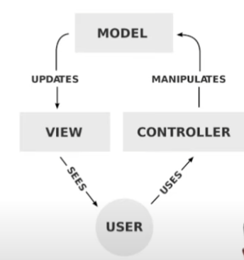

# Model-View Controller
- MVC is a software design pattern for implementing user interfaces on computers. It divides a given software application into three interconnected parts, so as to separate internal representations of information from the ways that information is presented to or accepted from the user.
- Originally introduced in 1979 by Trygve Reenskaug, then working on Smalltalk at Xerox PARC, MVC has been used for decades in GUI programming.
- There are many variations of MVC, but the traditional, and most common, implementation of MVC is often referred to as "vanilla" or "full-stack" MVC.
- 

## Model
- Models represent knowledge. A model could be a single object (rather uninteresting), or it could be some structure of objects.
  - The defination of model from Trygve Reenskaug

## View
- A view is a (visual) representation of its model. It would ordinarily highlight certain attributes of the model and suppress others. It is thus acting as a presentation filter.
- A view is attached to its model (or model part) and gets the data necessary for the presentation from the model by asking questions. It may also update the model by sending appropriate messages. All these questions and messages have to be in the terminology of the model, the view will therefore have to know the semantics of the attributes of the model it represents.

## Controller
- A controller is the link between a user and the system. It provides the user with input by arranging for relevant views to present themselves in appropriate places on the screen. It provides means for user output by presenting the user with menus or other means of giving commands and data. The controller receives such user output, translates it into the appropriate messages and pass these messages on to one or more of the views.
- A controller should never supplement the views (**Sepreation of concerns**), it should for example never conect the view nodes by drawing arrows between them.
- Conversely, a view should never know about user input, such as mouse operations and keystrokes. It should always be possible to write a method in a controller that sends messages to views which exactly reproduce any sequence of user commands.

### Applicability
- Original designed for GUI applications, but it can be used in any application where there is a need to separate domain data (model) from the user interface (view) and user input (controller) based on the concern separation principle.
- Separation of concerns - Models and views are decoupled, and they are connected by controllers. The separation of concerns principle allows for separately managing each aspect of the application.
- State of interaction are maintained in the controller in the system memory
- MVC is a conceptual framework, it is good to use it as a guide for structuring your code but one can stray from it if it makes sense to do so.