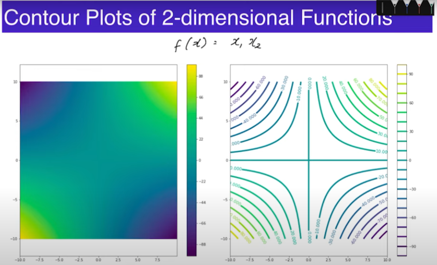
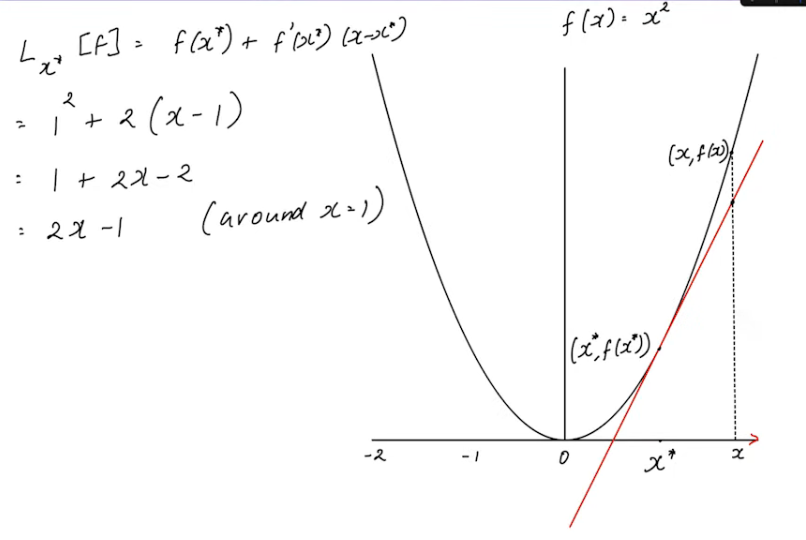

# Sets

### Notation

- $\mathbb{R}$ is the set of real numbers
- $\mathbb{R}_+$ is the set of all positive real numbers (including 0)
- $\mathbb{Z}$ is the set of all integers
- $\mathbb{Z}_+$ is the set of all positive integers (including 0)
- $[a, b] = \{x \in \mathbb{R} | a \leq x \leq b\}$ is the closed interval from $a$ to $b$
- $(a, b) = \{x \in \mathbb{R} | a < x < b\}$ is the open interval from $a$ to $b$
- $\mathbb{R}^d$ is the set of all $d$-dimensional vectors

### Matrix Spaces

- Distance between two matrices
  - $d(A, B) = \sqrt{\sum_{i=1}^m \sum_{j=1}^n (a_{ij} - b_{ij})^2}$
- Norm of a matrix
  - $B(x, \epsilon) = \{y \in \mathbb{R}^d | d(x, y) < \epsilon\}$ is the open ball of radius $\epsilon$ around $x$
  - $\bar{B}(x, \epsilon) = \{y \in \mathbb{R}^d | d(x, y) \leq \epsilon\}$ is the closed ball of radius $\epsilon$ around $x$

### Sets and Logic

- $U$ is the universal set
- $A \subseteq U$ means that $A$ is a subset of $U$
- $A \cup B$ is the union of $A$ and $B$
- $A \cap B$ is the intersection of $A$ and $B$
- $A^c$ is the complement of $A$ = $U \setminus A$
- $(A \cup B)^c = A^c \cap B^c$
- $(A \cap B)^c = A^c \cup B^c$
- $\forall$ means **for all**
- $\exists$ means **there exists**

### Sequences

- Sequences are ordered lists of elements from a set, they can be finite or infinite in length. They can be defined recursively or explicitly.
- $a_n$ is the $n$th element of the sequence
- Explicit definition: $a_n = f(n)$
  - Example: $a_n =  (1 + \frac{4}{2^n}, 3 - \frac{4}{2^n})$
- Some series are convergent and some are divergent
  - Convergent series have a finite limit
  - Divergent series have an infinite limit

### Vector Spaces

- If $V$ is a vector space, then $V$ must satisfy the following properties:
  - $V$ is closed under addition
  - $V$ is closed under scalar multiplication
  - $V$ contains the zero vector
  - $V$ contains the additive inverse of every vector in $V$

#### Vector Operations

- The dot product of two vectors is a scalar value
- $x \cdot y = x^Ty = \sum_{i=1}^n x_iy_i$
- $||x||^2 = x \cdot x = x^Tx = \sum_{i=1}^n x_i^2$
- Two vectors are orthogonal if their dot product is 0 ($x \cdot y = 0$)
  - Orthogonal vectors are linearly independent
  - Orthogonal vectors are perpendicular to each other

# Functions and Graphs

$$f: A \rightarrow B$$

- $1-$dimensional function
  - $f: \mathbb{R} \rightarrow \mathbb{R}$
- $d-$dimensional function
  - $f: \mathbb{R}^d \rightarrow \mathbb{R}$
  - $G_f \in \mathbb{R}^{A+1}$
  - $G_f = \{(x, f(x)) : x \in \mathbb{R}^d\}$

#### Contour Plots

**Contour plots** are a way to visualize a function of two variables. The $x$ and $y$ axes represent the two variables, and the $z$ axis represents the value of the function at that point.

## Continuity of a Function

$$f: \mathbb{R} \rightarrow \mathbb{R}$$

- is continuous at $x^* \in \mathbb{R}$ if for all sequences $x_n$ converging to $x^*$, $f(x_n)$ converges to $f(x^*)$
- $\lim_{i \rightarrow \infty} f(x_i) = f(\lim_{i \rightarrow \infty} x_i)$

## Differentiability of a Function

- A fucntion $f : \mathbb{R} \rightarrow \mathbb{R}$ is differentiable at $x^* \in \mathbb{R}$ if there exists a number $f'(x^*) \in \mathbb{R}$ such that
  - $f(x) = f(x^*) + f'(x^*)(x - x^*) + \epsilon(x)(x - x^*)$
  - $\lim_{x \rightarrow x^*} \epsilon(x) = 0$
  - $f'(x^*)$ is the slope of the tangent line to $f$ at $x^*$

## Linear Approximation

- Let $f : \mathbb{R} \rightarrow \mathbb{R}$ be differentiable function
- $f'(x^*): \lim_{x \rightarrow x^*} \frac{f(x) - f(x^*)}{x - x^*}$
- $f(x) \approx f(x^*) + f'(x^*)(x - x^*)$ is the linear approximation of $f$ at $x^*$
- This is the linear approximation of $f$ at $x^*$
- $f(x) \approx L_{x^*}[f](x)$ is the linear approximation of $f$ around $x^*$

#### Example

###### The red line is the linear approximation of $f$ at $x^*$, the closer it will be the better the approximation

#### Example

- A tangent is a line that touches a curve at a point and has the same slope as the curve at that point, it is also linear approximation of the curve at that point

- Find the linear approximation of $f(x) = \sin(x)$ around $x^* = 0$
  - $f'(x) = \cos(x)$
  - $f'(0) = 1$
  - $f(x) \approx f(0) + f'(0)(x - 0) = x$
  - $f(x) \approx x$ is the linear approximation of $f$ around $x^* = 0$
- Find the linear approximation of $f(x) = \ln(1+x)$ around $x^* = 0$
  - $f'(x) = \frac{1}{1+x}$
  - $f'(0) = 1$
  - $f(x) \approx \ln(1) + 1(x - 0) = x$
  - $f(x) \approx x$ is the linear approximation of $f$ around $x^* = 0$
- Find the linear approximation of $f(x) = (1+x)^r$ around $x^* = 0$, $r$ is some random integer
  - $f'(x) = r(1+x)^{r-1}$
  - $f(x^*) = 1$
  - $f'(x^*) = r$
  - $f(x) \approx 1 + r(x - 0) = 1 + rx$
  - valid around $x^* = 0$

### Why do we care about linear approximation?

- We can approximate a function with a linear function, which is much easier to work with than a non-linear function. This is useful for optimization problems.
- We can use higher order approximations to get better approximations of functions around a point but they are more complicated to work with. Sometimes we can use a linear approximation to get a good enough approximation of a function.

### Product Rule using Linear Approximation

- Suppose $x^* = 0$
- $$
  \begin{align*}
    f(x) &= g(x)\cdot h(x) \\
    f(x) &\approx (g(0)+g'(0))\cdot(h(0)+xh'(0))\\
    &\approx g(0)h(0) + x[g(0)h'(0) + g'(0)h(0)] + x^2g'(0)h'(0)\\
  \\
  L_x[f] &= f(0) + f'(0)x + xf'(0) \\
  f'(0) &= g(0)h'(0) + g'(0)h(0)\\
  \end{align*}
  $$
- We can use this to find the derivative of a function

### Chain Rule using Linear Approximation

- Suppose $x^* = 0$
- $$
  \begin{align*}
    f(x) &= g(h(x)) \\
    f(x) &\approx g(h(0)) + g'(h(0))h'(0)x \\
  \\
  L_x[f] &= f(0) + f'(0)x \\
  f'(0) &= g'(h(0))h'(0) \\
  \end{align*}
  $$
- We can use this to find the derivative of a function
- We ignore the second order term because it is very small and we are using linear approximation to approximate the function.

### Maxima, Minima, and Saddle Points

- Let $f : \mathbb{R}^d \rightarrow \mathbb{R}$ be a function
- $L_{x^*}[f] = f(x^*) + f'(x^*)(x - x^*)$
- $f'(x^*) = 0$ is a necessary condition for $x^*$ to be a local maxima, minima, or saddle point.
- It is a critical point if $f'(x^*) = 0$

## Multivariate Calculus

- Let $f : \mathbb{R}^d \rightarrow \mathbb{R}^d$ be a function
- A line through the point point $u \in \mathbb{R}^d$ along the vector $v \in \mathbb{R}^d$
  - $= \{ x \in \mathbb{R}^d : x = u + dv, \text{for } d \in \mathbb{R}\}$
- Line through $u, u' \in \mathbb{R}^d$
  - $= \{ x \in \mathbb{R}^d : x = u + d(u + u'), \text{for } d \in \mathbb{R}\}$
- Tangent plane to $f$ at $x^* \in \mathbb{R}^d$

### Geometry of (Hyper)planes

- A $(d-1)$ dimensional plane in $\mathbb{R}^d$ is a set of the form
  - $= \{ x \in \mathbb{R}^d : a^Tx = b\}$, where $a \in \mathbb{R}^d$ and $b \in \mathbb{R}$

### Partial Derivatives

- $f : \mathbb{R}^2 \rightarrow \mathbb{R}$
- $f(x_1, x_2) = x_1^2 + x_2^2$
- $$\frac{\partial f}{\partial x_1}(v) = \lim_{\alpha \rightarrow 0}\frac{f(v + \alpha_1 v_2 ) - f(v_1,v_2)}{\alpha}$$
  - We are taking the derivative of $f$ with respect to $x_1$ and holding $x_2$ constant at $v_2$
- $$\frac{\partial f}{\partial x_2}(v) = \lim_{\alpha \rightarrow 0}\frac{f(v + \alpha_2 v_1 ) - f(v_1,v_2)}{\alpha}$$
  - We are taking the derivative of $f$ with respect to $x_2$ and holding $x_1$ constant at $v_1$

#### Partial Derivative in d-dimensions

- $$\frac{\partial f}{\partial x_i}(v) = \lim_{\alpha \rightarrow 0}\frac{f(v + \alpha e_i ) - f(v)}{\alpha}$$
  - We are taking the derivative of $f$ with respect to $x_i$ and holding all other variables constant

#### Gradient

- $f: \mathbb{R}^d \rightarrow \mathbb{R}$
- $$
  \nabla f(v) = \begin{bmatrix}
    \frac{\partial f}{\partial x_1}(v) \\
    \frac{\partial f}{\partial x_2}(v) \\
    \vdots \\
    \frac{\partial f}{\partial x_d}(v) \\
  \end{bmatrix}
  $$
