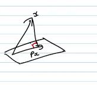

# Eigenvalues and Eigenvectors

### Solving a system of linear equations is equivalent to finding the eigenvalues and eigenvectors of a matrix.

- The eigenvalues and eigenvectors of a matrix are the same as the eigenvalues and eigenvectors of the linear transformation represented by the matrix.
- $\frac{dv}{dt} = 4v-5w$, $v=8$ at $t=0$, $\frac{dw}{dt} = 2v-3w$, $w=5$ at $t=0$
- $v(t) = \begin{bmatrix}v(t) \\ w(t) \end{bmatrix}$ and $u(0) = \begin{bmatrix}8 \\ 5 \end{bmatrix}$
- This can be rewritten as
  - $\frac{du}{dt} = Au$, where $A = \begin{bmatrix}4  -5 \\ 2  -3 \end{bmatrix}$
  - The solution for this is $u(t) = e^{At}u(0)$

### Case of a 2-dimensional parameter

- $v(t) = e^{\lambda t}y, w(t)=e^{\lambda t}z$
  - $u(t) = e^{\lambda t} x$, where $x = \begin{bmatrix}y \\ z \end{bmatrix}$
- If we substitute this in $\frac{du}{dt} = Au$, we get
  - $e^{\lambda t} y = 4e^{\lambda t} y - 5e^{\lambda t} z$
  - $\lambda e^{\lambda t} z = 2e^{\lambda t} y - 3e^{\lambda t}$
    - Taking out the common factor $e^{\lambda t}$, we get
      - $\lambda y = 4y - 5z$
      - $\lambda z = 2y - 3z$
- This can be rewritten as
  - $Ax = \lambda x$, where $x = \begin{bmatrix}y \\ z \end{bmatrix}$
- We can solve $\frac {du}{dt} = Au$ by solving $Ax = \lambda x$

### Eigenvalues and Eigenvectors

- For a matrix $A$ , $\lambda$ is a eigenvalue of $A$ if there exists a non-zero vector $x$ such that $Ax = \lambda x$
- If $x$ is an eigenvector and $x \neq 0$ then $x$ is an eigenvector of $A$ corresponding to $\lambda$ and $Ax= \lambda x$
- If $x$ is an eigenvector of $A$, then $A$ is a linear transformation that scales $x$ by $\lambda$. The direction of $x$ is unchanged by $A$.
- Symmetric matrices have real eigenvalues and orthogonal eigenvectors
  - A matrix whose eigenvalues are not real : $A = \begin{bmatrix} 0 & -1 \\ 1 & 0 \end{bmatrix}$
  - $det(A - \lambda I) = 0$
    - $\lambda^2 + 1 = 0$
    - $\lambda = \pm i$
- 

#### Special Case $\lambda = 0$

- If $\lambda = 0$, then $Ax = 0x = 0$ for some non-zero vector $x$. This means that $A$ is a linear transformation that maps $x$ to $0$.
  - $Ax = 0 \rightarrow x \in NullSpace(A)$

#### Examples

- Projections of Matrix P
  - Projection onto a plane
  - 
  - $Px = x$ for any $x$ in the plane
    - $\lambda = 1$ is an eigenvalue & any $x$ in the plane is an eigenvector
  - Consider an $x$ that is perpendicular to the plane
    - $Px = 0$ for any $x$ perpendicular to the plane
    - So $\lambda = 0$ is an eigenvalue & any $x$ perpendicular to the plane is an eigenvector
- Permutation Matrix $P$
  - Take the identity matrix $I$ and shuffle the rows
    - $B = \begin{bmatrix}0 & 1  \\ 1 & 0 \end{bmatrix}$
  - $Bx = x$ for $x = \begin{bmatrix}x_1 \\ x_2 \end{bmatrix}$
    - $\lambda = 1$ is an eigenvalue & any $x$ is an eigenvector
    - $Bx = \begin{bmatrix}1 \\ -1 \end{bmatrix}$

## Finding the Eigenvalues

- $Ax = \lambda x$ can be rewritten as $(A - \lambda I)x = 0$ is singular
  - $det(A - \lambda I) = 0$
  - "n" roots of a characteristic polynomial = eigenvalues
- For Eigenvectors : Given $\lambda$, want $(A -\lambda I) x = 0$
  - i.e., $x \in NullSpace(A - \lambda I)$

#### Example

- $A = \begin{bmatrix} 3 & 1 \\ 1 & 3 \end{bmatrix}$
- $det(A - \lambda I) = 0$
  - $\lambda^2 - 6\lambda + 8 = 0$
  - $\lambda_1 + \lambda_2 = 6$
  - $\lambda_1 \lambda_2 = 8$
  - Solving this, we get
  - $\lambda_1 = 4, \lambda_2 = 2$
  - $A - 4I = \begin{bmatrix} -1 & 1 \\ 1 & -1 \end{bmatrix}$
    - $x_1 + x_2 = 0$
    - $x_1 = x_2$
    - $x_1 = \begin{bmatrix} 1 \\ 1 \end{bmatrix}$
  - $A - 2I = \begin{bmatrix} 1 & 1 \\ 1 & 1 \end{bmatrix}$
    - $x_1 + x_2 = 0$
    - $x_1 = -x_2$
    - $x_1 = \begin{bmatrix} 1 \\ -1 \end{bmatrix}$
